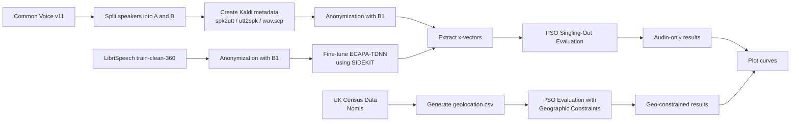

# PSO Evaluation with Geographic Side Information in Voice Data

This repository contains the code used to evaluate **singling-out risk in anonymized speech data** using the **Predicate Singling-Out (PSO)** framework combined with **geographic side information**.

The work extends the evaluation protocol introduced in:

Vauquier et al., *Legally grounded evaluation of voice anonymisation*, 2025.

The goal is to study how **geographic attributes at different spatial resolutions** affect singling-out risk in anonymized speech datasets.

---

## Pipeline Summary

1. Download Common Voice v11 (English) and prepare Kaldi metadata (`spk2utt`, `utt2spk`, `spk2gender`).
2. Split Common Voice into **A** (evaluation speakers) and **B** (predicate speakers), then create `wav.scp` for A and B.
3. Download LibriSpeech `train-clean-360`.
4. Clone Voice Privacy Challenge 2022 and anonymize **A**, **B**, and LibriSpeech with **Baseline B1**.
5. Clone SIDEKIT and fine-tune an **ECAPA-TDNN** speaker embedding extractor on **anonymized LibriSpeech** (semi-informed attacker).
6. Extract x-vectors for anonymized A and B using SIDEKIT (`extract_xvector.py`).
7. Run PSO singling-out evaluation (`compute_iso_devTrue_plot2.py`) and plot results (`plot_singout_combined.py`).
8. Download UK Census geographic statistics (Nomis), build `geolocation.csv`, run geographic PSO evaluation (`pso_geo_all.py`), and plot (`plot_all.py`).

---

## Installation

Clone this repository:

```bash
git clone https://github.com/nobody-interspeech/pso-geo-voice-privacy.git
cd pso-geo-voice-privacy
```

Install dependencies:

```bash
pip install -r requirements.txt
```

Recommended environment: **Python >= 3.8**

---

## Step 1 — Download Speech Datasets

### Common Voice v11

Download the **English subset of Mozilla Common Voice v11**.

Prepare Kaldi-style metadata:

* `spk2utt`
* `utt2spk`
* `spk2gender`

Split the dataset into:

* **Subset A**: evaluation speakers
* **Subset B**: predicate construction speakers

Create `wav.scp` for each subset (A and B), listing all utterance paths.

### LibriSpeech

Download LibriSpeech:

* `train-clean-360`

This dataset is used to train the semi-informed attacker embedding extractor.

---

## Step 2 — Voice Anonymization (Voice Privacy Challenge 2022, Baseline B1)

Clone the Voice Privacy Challenge 2022 repository:

```bash
git clone https://github.com/Voice-Privacy-Challenge/Voice-Privacy-Challenge-2022
```

Use the **Baseline B1** anonymization system from the VPC2022 repository to anonymize:

* Common Voice subset **A**
* Common Voice subset **B**
* LibriSpeech **train-clean-360**

After this step, you should have anonymized WAV files for A, B, and LibriSpeech.

---

## Step 3 — Attacker Models

We consider two attacker scenarios.

### Ignorant attacker

The attacker uses the **original pre-trained ECAPA-TDNN** model (no adaptation) and is unaware that data have been anonymized.

### Semi-informed attacker

The attacker can access anonymized training data and **fine-tunes** an ECAPA-TDNN extractor on anonymized speech (here: anonymized LibriSpeech `train-clean-360`). This adapted extractor is then used to compute embeddings on anonymized evaluation data.

---

## Step 4 — Fine-tuning ECAPA-TDNN on Anonymized LibriSpeech (SIDEKIT)

### Clone SIDEKIT

```bash
git clone https://git-lium.univ-lemans.fr/speaker/sidekit.git
```

### Dataset structure

The ECAPA extractor is trained on **anonymized LibriSpeech train-clean-360** (B1 applied). Example structure:

```
LibriSpeech_B1/
  train-clean-360/
    speaker_id/
      chapter_id/
        utterance.wav
```

### Model and training settings (typical)

* Architecture: **ECAPA-TDNN**
* Embedding dimension: **256**
* Pooling: Attentive Statistics Pooling
* Loss: Circle loss
* Sample rate: **16 kHz**
* Segment duration: **3 s** (random chunk sampling)

Example training hyperparameters:

* Batch size: **192**
* Epochs: **50**
* Optimizer: **AdamW**
* Learning rate: **1e-3**
* Scheduler: OneCycleLR
* Validation split: **2%**
* Mixed precision: enabled

### Configuration files

Training relies on configuration files (example):

```
config/
  Librispeech.yaml
  model.yaml
  training.yaml
```

### Train the extractor

Example command (SIDEKIT recipe):

```bash
python egs/librispeech/local/train_xvector.py \
  --dataset config/Librispeech.yaml \
  --model config/model.yaml \
  --training config/training.yaml
```

Multi-GPU example:

```bash
torchrun --nproc_per_node=2 \
  egs/librispeech/local/train_xvector.py \
  --dataset config/Librispeech.yaml \
  --model config/model.yaml \
  --training config/training.yaml
```

### Training Output

Training produces checkpoints such as:

```
model_libri_b1_ecapa/
  best_model.pt
  tmp_model.pt
```

`best_model.pt` is used as the **semi-informed attacker** embedding extractor.

---

## Step 5 — Extract x-vectors for A and B (SIDEKIT)

SIDEKIT provides `extract_xvector.py`. Configure it to load:

* the fine-tuned model (`best_model.pt`) for the **semi-informed attacker**
* the original pre-trained model for the **ignorant attacker**

Then extract x-vectors for anonymized:

* Common Voice subset **A**
* Common Voice subset **B**

These embeddings are used in the PSO evaluation.

---

## Step 6 — PSO Singling-Out Evaluation (Audio-only)

Run the PSO singling-out evaluation:

* `compute_iso_devTrue_plot2.py`

This script outputs CSV files containing singling-out probabilities.

Generate plots with:

* `plot_singout_combined.py`

This produces the curves for the **semi-informed attacker** (and optionally the ignorant attacker if you run both extractors).

---

## Step 7 — Geographic Side Information

Geographic statistics are obtained from **Nomis**:

[https://www.nomisweb.co.uk](https://www.nomisweb.co.uk)

The script `geolocation_data_code.py` is used to generate a speaker-level geographic metadata file:

* `geolocation.csv`

This file links speakers to geographic units (e.g., OA / LSOA / MSOA / household).

---

## Step 8 — PSO Evaluation with Geographic Constraints

Run the PSO evaluation incorporating geographic side information:

* `pso_geo_all.py`

This script computes singling-out probabilities when geographic information is used to **restrict the candidate set**.

Generate plots with:

* `plot_all.py`

---

## Output

The pipeline produces:

* CSV files containing singling-out probabilities
* plots used in the paper
* results across attacker scenarios and geographic resolutions

---

## Reproducibility Notes

To support reproducibility:

* all training data are anonymized with the same **VPC2022 Baseline B1** system
* configuration files used to fine-tune ECAPA-TDNN are included
* required dependencies are listed in `requirements.txt`

---

## Citation

If you use this repository, please cite the corresponding publication.

---

## Pipeline Diagram

The following diagram summarizes the complete experimental pipeline used in this project.



---

## Folder Structure

```
pso-geo-voice-privacy/
│
├── compute_iso_devTrue_plot2.py
├── pso_geo_all.py
├── plot_singout_combined.py
├── plot_all.py
├── geolocation_data_code.py
├── geolocation.csv
├── requirements.txt
├── README.md
│
└── Data/
    ├── A-B split/
    │   ├── cv11-A-filelist
    │   └── cv11-B-filelist
    ├── cv11-enroll/
    │   ├── spk2gender
    │   ├── spk2utt
    │   └── utt2spk
    └── cv11-trial/
        ├── spk2gender
        ├── spk2utt
        └── utt2spk
```

### Script description

**compute_iso_devTrue_plot2.py**

Implements the Predicate Singling-Out (PSO) evaluation for the **audio-only scenario**.  
It computes singling-out probabilities using speaker embeddings extracted from anonymized speech.

---

**pso_geo_all.py**

Extends the PSO evaluation by incorporating **geographic side information**.  
Candidate speakers are restricted using geographic attributes derived from census data.

---

**plot_singout_combined.py**

Generates the plots of singling-out probability for the **audio-only evaluation**.

---

**plot_all.py**

Generates the plots for the **geographic side-information experiments**.

---

**geolocation_data_code.py**

Processes census data downloaded from **Nomis** and generates the file `geolocation.csv`, which associates speakers with geographic regions.

---

**Data/A-B split/**

Contains the file lists used to partition Common Voice speakers into:

* **Subset A** – evaluation speakers
* **Subset B** – predicate construction speakers

---

**Data/cv11-enroll/** and **Data/cv11-trial/**

Contain Kaldi-style metadata files (`spk2utt`, `utt2spk`, `spk2gender`) for enrollment and trial subsets.
